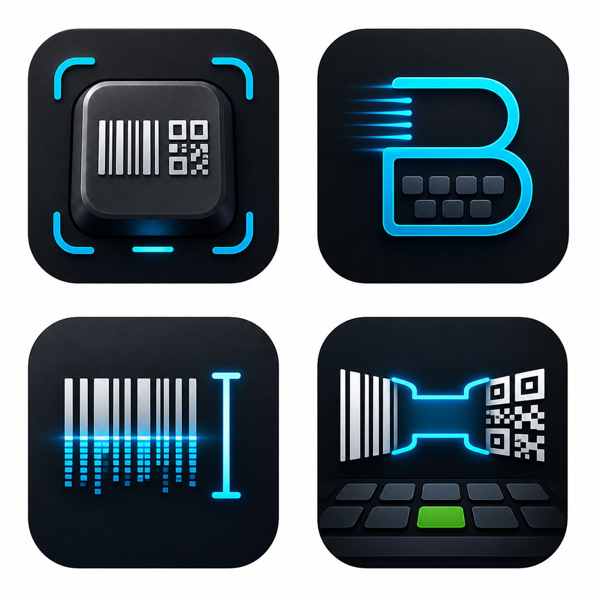

# Blip: Barcode QR Keyboard

Blip is a prototype iOS keyboard wedge for company workflows. It adds a custom keyboard with a scan button, opens a scanner when employees need to scan a barcode or QR code, then inserts the result back into the original text field.

The current Xcode project and target names still use the internal prototype name `BarcodeKeyboard`, but the installed app, keyboard display name, bundle identifiers, URL scheme, and app group now use Blip branding.



## Current Capabilities

- Custom iOS keyboard extension with a familiar keyboard-style UI.
- English and German keyboard language options.
- Configurable keyboard profiles: letters, numbers and symbols, big-number pad, or scan-only.
- Scanner built with AVFoundation and Vision.
- Scan-format profiles for common barcodes, barcodes plus QR, or all supported formats.
- Flashlight toggle and default flashlight preference.
- Optional Blip scan sound.
- Configurable return targets: Safari, Chrome, Edge, Firefox, Brave, or custom URL scheme.
- App Group handoff so the scanner app can queue a result for the keyboard to insert once.
- Configurable scan suffix: none, tab, enter, or space.
- Setup flow with keyboard detection, `Check Again`, settings shortcut, and diagnostics.
- English and German app localization.

## How It Works

iOS keyboard extensions cannot access the camera directly, so Blip uses a containing app for scanning:

1. The user taps `Scan` on the custom keyboard.
2. The keyboard opens `blip://scan`.
3. The containing app scans the barcode or QR code.
4. The scan result is saved in the shared App Group with a request id.
5. Blip returns to the configured target app.
6. When the keyboard becomes active again, it inserts the matching pending scan through `textDocumentProxy`.

See [Architecture](docs/ARCHITECTURE.md) for more detail.

## Repository Layout

```text
App/                 Containing SwiftUI app, scanner, setup, and settings
KeyboardExtension/   Custom keyboard extension
Shared/              Shared settings, scan session, and app-group state
Branding/            Blip naming and icon exploration
docs/                Architecture, development, and test notes
project.yml          XcodeGen project definition
```

## First-Time Device Setup

1. Build and install the app from Xcode.
2. Open the Blip app.
3. Tap `Open Keyboard Settings`.
4. In iOS Settings, tap `Keyboards`.
5. Enable the Blip keyboard.
6. Enable `Allow Full Access`.
7. Return to Blip and tap `Check Again`.
8. If iOS still does not refresh the keyboard state, fully close and reopen Blip.

For best employee experience, remove unused keyboards from iOS Keyboard settings so users do not accidentally switch to a keyboard without a scanner.

## Development

Open the checked-in project:

```sh
open BarcodeKeyboard.xcodeproj
```

Build for simulator:

```sh
xcodebuild -project BarcodeKeyboard.xcodeproj \
  -scheme BarcodeKeyboard \
  -destination 'generic/platform=iOS Simulator' \
  build
```

Build for a physical iPhone:

```sh
xcodebuild -project BarcodeKeyboard.xcodeproj \
  -scheme BarcodeKeyboard \
  -destination 'id=<DEVICE_ID>' \
  build
```

More setup notes live in [Development](docs/DEVELOPMENT.md).

Third-party asset credits are tracked in [Third-Party Notices](THIRD_PARTY_NOTICES.md).

## Validation

The important workflow must be tested on a physical iPhone:

- enable keyboard and Allow Full Access
- open the keyboard from Safari or another target app
- scan from the keyboard
- return to the selected target app
- insert exactly once into the original field

See [Test Plan](docs/TEST_PLAN.md).

## Branding

Current preferred product name:

**Blip: Barcode QR Keyboard**

Short display name:

**Blip**

Positioning:

**Scan into any field.**

See [Branding](docs/BRANDING.md) for icon concepts and direction.

## Known Platform Constraints

- Camera access must happen in the containing app, not the keyboard extension.
- iOS does not provide a perfect public "return to previous app" API.
- Return-target behavior needs physical-device testing for each browser or target app.
- Bundle identifier changes should be planned carefully because they affect installed keyboards and provisioning.
