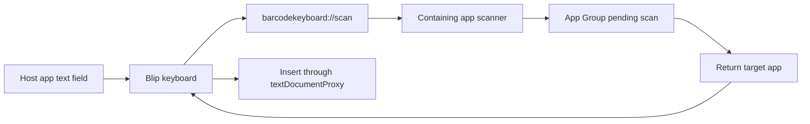

# Architecture

Blip is built as a containing iOS app plus a custom keyboard extension.

## Main Components

- `App/`: SwiftUI containing app, setup flow, scanner UI, settings, and return-target handling.
- `KeyboardExtension/`: custom keyboard extension that renders the keyboard and inserts text through `textDocumentProxy`.
- `Shared/`: app-group-backed settings and scan handoff state used by both targets.
- `Branding/`: generated icon concepts and brand notes.

## Scan Handoff

The keyboard extension cannot access the camera. It opens the containing app, the app scans with `AVCaptureSession` and Vision, then the result is stored in the app group. When the keyboard becomes active again, it consumes the matching pending scan id and inserts once.

## App Group

Both targets use:

- `group.com.antoniobeslic.BarcodeKeyboard`

This stores keyboard layout settings, scanner settings, last scan, pending scan text, and handoff identifiers.

## Bundle Identifiers

Current prototype identifiers:

- App: `com.antoniobeslic.BarcodeKeyboard`
- Keyboard extension: `com.antoniobeslic.BarcodeKeyboard.KeyboardExtension`

The public product name can be changed later without changing these ids immediately. Keep bundle id changes deliberate because they affect installed keyboards and provisioning.

## Platform Constraints

- Third-party keyboard extensions cannot use the camera directly.
- iOS does not expose a perfect public API for "return to previous app".
- Return-target behavior must be tested on a physical device for each target app.
- Full Access is needed for reliable app-group communication between the containing app and keyboard extension.
