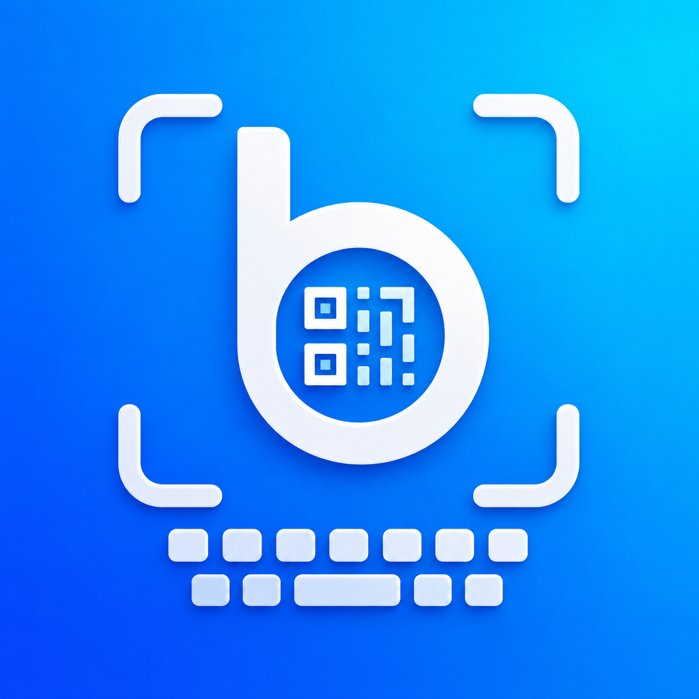

# Branding

## Working Name

Recommended App Store title:

**Blip: Barcode QR Keyboard**

Short home-screen name:

**Blip**

Positioning line:

**Scan into any field.**

## Brand Direction

Blip should feel like a reliable company utility rather than a consumer novelty app:

- Practical
- Fast
- Trustworthy
- Clean enough for enterprise rollout
- Friendly enough that non-technical employees understand it

## Visual Direction

- Deep graphite / near-black base
- Electric cyan or blue scan accent
- Small green success accent only where useful
- Simple keycap, scan-frame, barcode, QR, or text-cursor motifs
- No words inside the app icon

## Generated Icon Concepts

Selected app icon source:



Generated concept sheet:


Individual 1024x1024 candidates:

- [Concept 1: keycap scanner](../Branding/IconConcepts/blip-icon-concept-1.png)
- [Concept 2: stylized scan mark](../Branding/IconConcepts/blip-icon-concept-2.png)
- [Concept 3: barcode to cursor](../Branding/IconConcepts/blip-icon-concept-3.png)
- [Concept 4: barcode/QR bridge](../Branding/IconConcepts/blip-icon-concept-4.png)
- [Standalone top-right draft](../Branding/IconConcepts/blip-icon-top-right-1024.png)

Current selected direction: blue gradient background, white scan frame, `b` mark, QR glyph, and keyboard motif. The Xcode app icon is generated from this full-square source in `App/Assets.xcassets/AppIcon.appiconset`.

Earlier recommendation: Concept 1 explains the product fastest. Concept 3 is cleaner at small icon size.

## Generation Prompt

```text
Create four premium app icon concepts for an iOS app named Blip: Barcode QR Keyboard. The app scans barcodes and QR codes from a custom keyboard and inserts the result into text fields. Use a polished vector-friendly 3D/icon design, modern enterprise utility feel, deep graphite backgrounds, electric cyan/blue accents, and no text.
```
